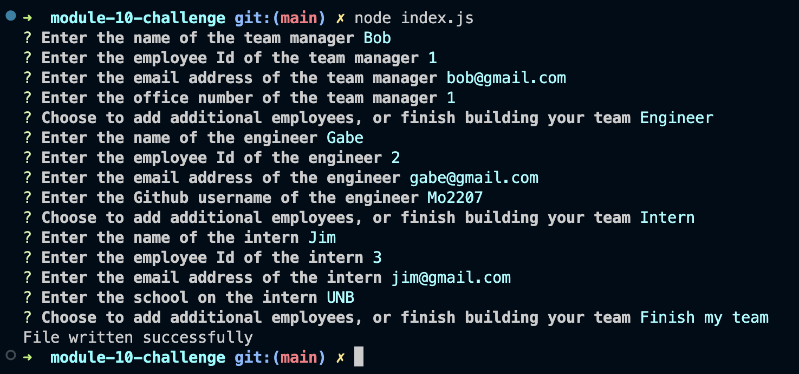

# Team-Profile-Generator

## Description:
  
This application uses input from the user via command-line/terminal prompts using inquirer and generates an html page of the users team of employees.
  - I built this project to practise using node and inquirer, and to familiarize myself with breaking down a project into seperate folders/files based on function.
  - Making this project I learned how to use jest for testing and touble-shooting my code.
  
## Installation:
This project can be cloned into your project.

## Usage:

This project can be used by running 'node index.js' in the command-line or terminal. Then answer all prompts using the arrow/enter keys and an html file with your input will be generated.

## Credits:
This project is my own.

## License:
MIT license.